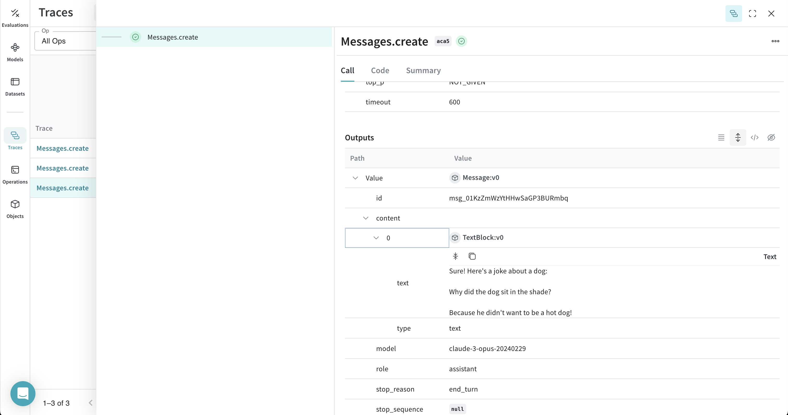
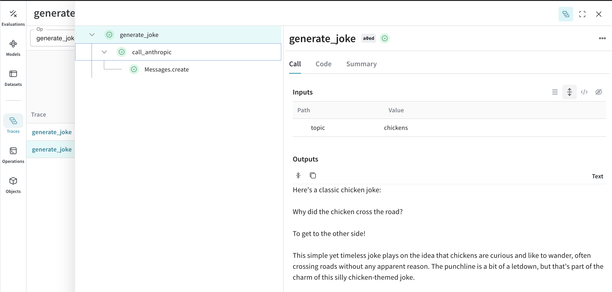
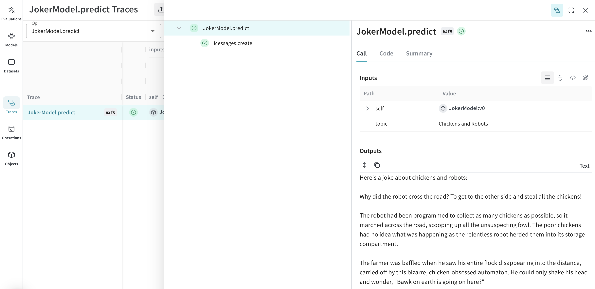
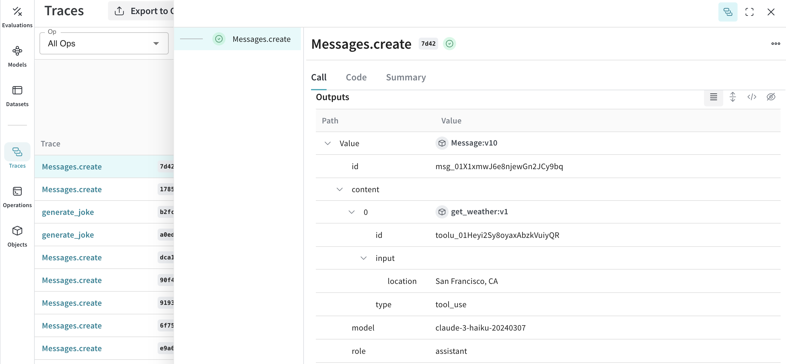

---
title: "Anthropic"
menu:
  weave:
    weight: 40
type: docs
--- 

Weave automatically tracks and logs LLM calls made via the [Anthropic Python library](https://github.com/anthropics/anthropic-sdk-python), after `weave.init()` is called.

:::note
Do you want to experiment with Anthropic models on Weave without any set up? Try the [LLM Playground](../tools/playground.md).
:::

## Traces

It’s important to store traces of LLM applications in a central database, both during development and in production. You’ll use these traces for debugging, and as a dataset that will help you improve your application.

Weave will automatically capture traces for [anthropic-sdk-python](https://github.com/anthropics/anthropic-sdk-python). You can use the library as usual, start by calling `weave.init()`:

```python
import weave

# use the anthropic library as usual
import os
from anthropic import Anthropic

# highlight-next-line
weave.init("anthropic_project")

client = Anthropic(
    api_key=os.environ.get("ANTHROPIC_API_KEY"),
)

message = client.messages.create(
    max_tokens=1024,
    messages=[
        {
            "role": "user",
            "content": "Tell me a joke about a dog",
        }
    ],
    model="claude-3-opus-20240229",
)
print(message.content)
```


Weave will now track and log all LLM calls made through the Anthropic library. You can view the traces in the Weave web interface.

[](https://wandb.ai/capecape/anthropic_project/weave/calls)

:::note
We patch the anthropic `Messages.create` method for you to keep track of your LLM calls.
:::


Weave will now track and log all LLM calls made through Anthropic. You can view the logs and insights in the Weave web interface.

## Wrapping with your own ops

Weave ops make results *reproducible* by automatically versioning code as you experiment, and they capture their inputs and outputs. Simply create a function decorated with [`@weave.op()`](https://wandb.github.io/weave/guides/tracking/ops) that calls into [`Anthropic.messages.create`](https://docs.anthropic.com/en/api/messages-examples) and Weave will track the inputs and outputs for you. Let's see how we can do this in nested example:

```python
import weave
import os
from anthropic import Anthropic

# highlight-next-line
weave.init("anthropic_project")
client = Anthropic(
    api_key=os.environ.get("ANTHROPIC_API_KEY"),
)


# highlight-next-line
@weave.op()
def call_anthropic(user_input: str, model: str) -> str:
    message = client.messages.create(
        max_tokens=1024,
        messages=[
            {
                "role": "user",
                "content": user_input,
            }
        ],
        model=model,
    )
    return message.content[0].text


# highlight-next-line
@weave.op()
def generate_joke(topic: str) -> str:
    return call_anthropic(
        f"Tell me a joke about {topic}", model="claude-3-haiku-20240307"
    )


print(generate_joke("chickens"))
print(generate_joke("cars"))
```

[](https://wandb.github.io/weave/guides/tracking/ops)

## Create a `Model` for easier experimentation

Organizing experimentation is difficult when there are many moving pieces. By using the [`Model`](/guides/core-types/models) class, you can capture and organize the experimental details of your app like your system prompt or the model you're using. This helps organize and compare different iterations of your app. 

In addition to versioning code and capturing inputs/outputs, [`Model`](/guides/core-types/models)s capture structured parameters that control your application’s behavior, making it easy to find what parameters worked best. You can also use Weave Models with `serve`, and [`Evaluation`](/guides/core-types/evaluations)s.

In the example below, you can experiment with `model` and `temperature`. Every time you change one of these, you'll get a new _version_ of `JokerModel`. 

```python
import weave

# use the anthropic library as usual
import os
from anthropic import Anthropic

weave.init("joker-anthropic")


class JokerModel(weave.Model):  # Change to `weave.Model`
    model: str
    temperature: float

    @weave.op()
    def predict(self, topic):  # Change to `predict`
        client = Anthropic()
        message = client.messages.create(
            max_tokens=1024,
            messages=[
                {
                    "role": "user",
                    "content": f"Tell me a joke about {topic}",
                }
            ],
            model=self.model,
            temperature=self.temperature,
        )
        return message.content[0].text


joker = JokerModel(model="claude-3-haiku-20240307", temperature=0.1)
result = joker.predict("Chickens and Robots")
print(result)
```

[](https://wandb.ai/capecape/anthropic_project/weave/calls)

## Tools (function calling)

Anthropic provides [tools](https://docs.anthropic.com/en/docs/tool-use) interface for calling functions. Weave will automatically track those functions calls.

```python
message = client.messages.create(
    max_tokens=1024,
    messages=[
        {
            "role": "user",
            "content": "What's the weather like in San Francisco?",
        }
    ],
    tools=[
        {
            "name": "get_weather",
            "description": "Get the current weather in a given location",
            "input_schema": {
                "type": "object",
                "properties": {
                    "location": {
                        "type": "string",
                        "description": "The city and state, e.g. San Francisco, CA",
                    }
                },
                "required": ["location"],
            },
        },
    ],
    model=model,
)

print(message)
```

We automatically capture the tools you used on the prompt and keep them versioned.

[](https://wandb.ai/capecape/anthropic_project/weave/calls)
